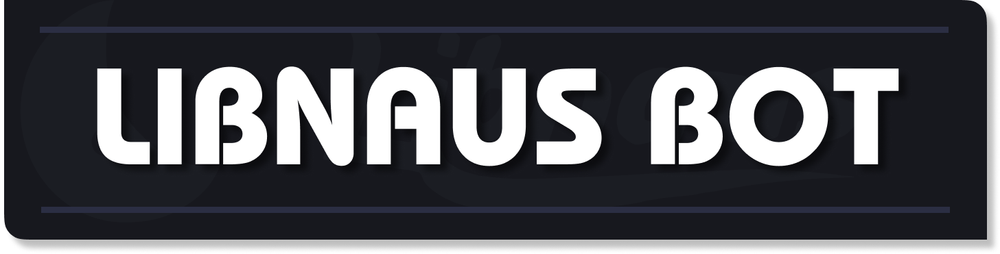
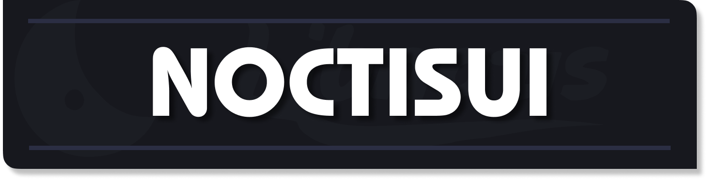

    <h1 style="font-size: 28px; margin: 0;">🌙 Libnaus - Studio de développement</h1>

Bienvenue dans le repository officiel de **Libnaus Studio**, regroupant nos différents projets de développement. Nous nous engageons à créer des solutions innovantes pour diverses plateformes.

      
    
  
    

## 📋 Projets
### 🤖 Libnaus Bot

    

**Libnaus Bot** est un assistant Discord multifonction conçu pour enrichir l'expérience de votre communauté. Entièrement **gratuit** et disponible en **français**, il répond aux besoins des administrateurs comme des utilisateurs.

#### Caractéristiques principales :
- ✅ **Gratuit** et accessible à tous
- 🇫🇷 Un projet **FRANÇAIS** de qualité
- 🖥️ **Dashboard intuitif** pour une gestion simplifiée
- 🛠️ **Multifonction** : modération, musique, utilitaires et plus
- 📈 **Évolutif** avec des mises à jour régulières

Libnaus Bot vous permet de gérer efficacement votre serveur grâce à son système de modération avancé, ses commandes ludiques, et ses fonctionnalités musicales. Son interface d'administration facilite la configuration et la personnalisation selon vos besoins.

> **Note :** Libnaus Bot est actuellement en développement. De nouvelles fonctionnalités sont régulièrement ajoutées pour améliorer l'expérience utilisateur.

  
## 🎮 NoctisUI

    

**NoctisUI** est un mod Minecraft partenariat-only permettant aux développeurs de créer des interfaces utilisateur personnalisées et interactives.

#### Caractéristiques principales :
- 🎨 **Création simplifiée** d'interfaces utilisateur
- 🔧 **Contrôle total** sur l'apparence et les fonctionnalités
- 🧩 **Intégration facile** dans vos propres mods
- 🔄 **Mise à jour régulière** et support continu

Ce framework puissant vous donne les outils nécessaires pour concevoir des menus, boutons et autres éléments d'interface qui enrichiront l'expérience des joueurs.

> **Important :** NoctisUI est réservé aux **partenaires officiels** de Libnaus Studio. Pour toute demande d'accès ou de changement de version Minecraft, veuillez ouvrir un ticket sur le [serveur Discord](https://discord.libnaus.fr/).

  

## 🚀 Installation et Utilisation

🔧 Libnaus Bot

- Ajoutez le bot à votre serveur Discord (lien à venir)

- Configurez le bot via le dashboard (interface en développement)

- Profitez des nombreuses fonctionnalités offertes

🎮 Noctis UI

- Devenez partenaire officiel de Libnaus Studio

- Recevez l'accès au mod et aux fichiers nécessaires

- Intégrez Noctis UI dans vos projets Minecraft

  

## 🤝 Contribuer
Nous accueillons favorablement les contributions à nos projets open-source. Avant de contribuer, veuillez ouvrir un ticket sur notre [serveur Discord](https://discord.libnaus.fr/).

## 📞 Support
Si vous rencontrez des problèmes ou avez des questions, n'hésitez pas à :
- Ouvrir une **Issue** sur GitHub
- Rejoindre notre **serveur Discord** : [discord.gg/libnaus](https://discord.libnaus.fr/)

## 📜 Licence
Libnaus Studio est un projet en cours de développement. Les conditions d'utilisation et la licence seront communiquées prochainement.

---

<h1 align="center">📌 **Développé avec passion par l'équipe Libnaus Studio** 🚀</h1>
